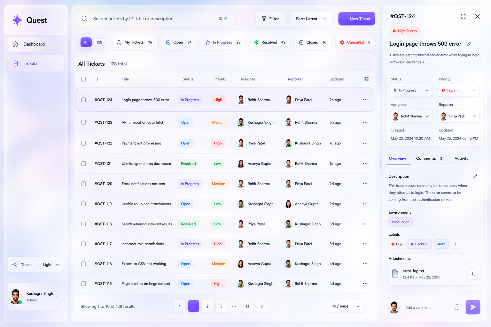
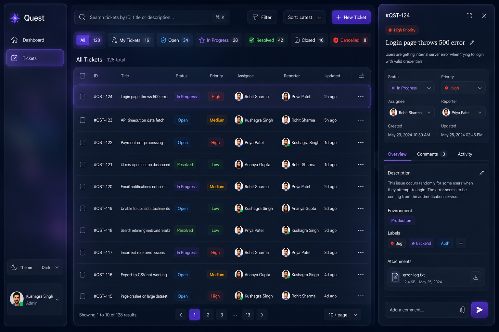
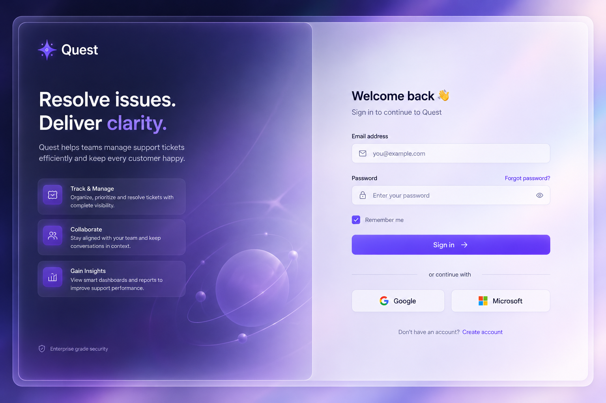
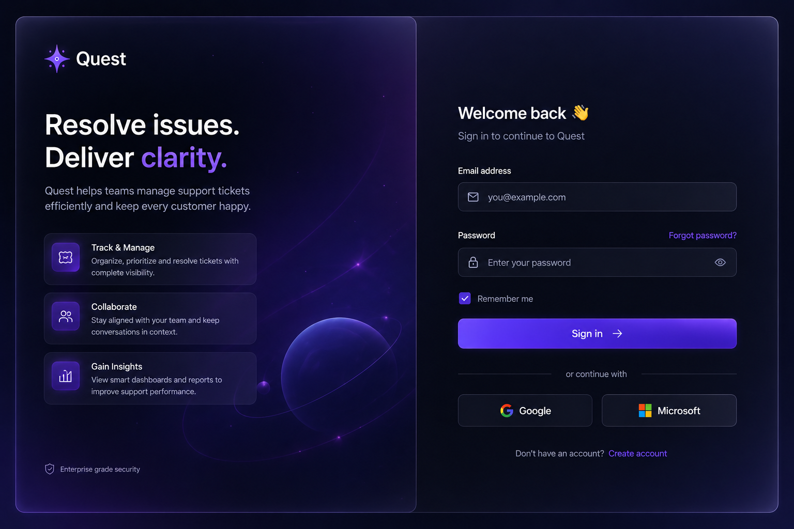

# UI/UX Design Specification

# Quest

> Modern Support Ticket Management Platform

**Version:** 1.0.0  
**Status:** Draft  
**Last Updated:** July 2026

---

# 1. Purpose

This document defines the visual language, interaction patterns, layout structure, and overall user experience for Quest.

It serves as the single source of truth for frontend implementation, ensuring a consistent, intuitive, and modern experience across the application.

---

# 2. Design Manifesto

Quest is designed around one simple principle:

> **Users should spend their time resolving tickets, not navigating software.**

Every interaction should reduce friction, preserve context, and eliminate unnecessary complexity.

The interface should feel calm, responsive, and familiar while maintaining enough flexibility to support future product growth.

---

# 3. Design Philosophy

Quest follows a minimalist design philosophy inspired by modern productivity software.

The experience emphasizes:

- Simplicity
- Speed
- Clarity
- Consistency
- Focus

Visual inspiration comes from products such as:

- Linear
- Arc Browser
- Notion
- Apple Human Interface Guidelines

The interface should feel premium without becoming visually distracting.

---

# 4. Design Principles

## Simplicity

Every component should have a clear purpose.

Unnecessary visual clutter and duplicate interactions should be avoided.

---

## Context Preservation

Users should rarely leave their current workspace.

Viewing, editing, commenting, and managing tickets should happen within the existing interface whenever possible.

---

## Direct Manipulation

Users interact directly with content.

Examples include:

- Double-click to edit text
- Inline dropdowns for properties
- Immediate filtering
- Live search

---

## Progressive Disclosure

Frequently used actions remain immediately visible.

Advanced functionality is available only when needed.

---

## Consistency

Spacing, typography, interaction patterns, and components should remain consistent throughout the application.

---

# 5. Visual Language

Quest uses a subtle glassmorphism aesthetic inspired by modern desktop and mobile operating systems.

The interface emphasizes:

- Frosted glass surfaces
- Soft shadows
- Thin borders
- Layered depth
- Gentle transparency
- Large rounded corners

Glass effects should support visual hierarchy rather than become decorative.

---

# 6. Theme Support

Quest supports three appearance modes:

- Light
- Dark
- System

The **System** option automatically follows the user's operating system preference.

User preference should persist across sessions.

---

# 7. Color Philosophy

Purple serves as the primary accent color throughout the application.

Ticket status and priority should be represented using semantic colors that remain consistent across the application.

Color should reinforce information rather than dominate the interface.

---

# 8. Navigation

Quest intentionally keeps navigation minimal.

Primary navigation includes:

- Dashboard
- Tickets

User profile and theme controls remain accessible from the sidebar.

New navigation items should only be introduced when they represent complete product modules.

---

# 9. Dashboard

The Dashboard provides a high-level overview of support operations.

Its purpose is to help users quickly understand the current state of work before moving into ticket management.

The Dashboard includes:

- Summary statistics
- Recently updated tickets
- Recent activity
- Quick actions

The Dashboard is intended for overview rather than day-to-day ticket management.

---

# 10. Tickets Workspace

The Tickets page is the primary workspace where users spend most of their time.

The workspace includes:

- Search
- Quick filters
- Advanced filters
- Sorting
- Ticket list
- Ticket Panel
- Ticket creation

The interface is optimized for efficient ticket management with minimal navigation.

---

# 11. Ticket Filtering

Quest provides quick filters for the most common ticket views.

Quick filters include:

- All
- My Tickets
- Open
- In Progress
- Resolved
- Closed
- Cancelled

The **My Tickets** filter displays tickets assigned to the currently authenticated user.

Selecting a quick filter immediately updates the ticket list.

---

## Search

Search updates dynamically as the user types.

Search supports:

- Ticket ID
- Ticket Title
- Ticket Description

---

## Advanced Filters

Additional filters are available through the **Filter** menu.

Examples include:

- Priority
- Assignee
- Reporter

Advanced filters can be combined with the currently selected quick filter.

---

## Sorting

Sorting options are available through the **Sort** control.

Examples include:

- Recently Updated
- Recently Created
- Priority
- Alphabetical

Sorting should not affect the currently selected filter.

---

# 12. Ticket List

Tickets are displayed using a responsive table optimized for scanning and productivity.

Each row presents the most relevant ticket information, including:

- Ticket ID
- Title
- Status
- Priority
- Assignee
- Reporter
- Last Updated

The entire row is clickable.

Hovering over a row provides subtle visual feedback through:

- Soft background elevation
- Border emphasis
- Cursor change

Bulk actions are intentionally excluded from the initial release.

---

# 13. Ticket Panel

Selecting a ticket opens a resizable side panel without navigating away from the ticket list.

The Ticket Panel supports:

- Resize
- Collapse
- Responsive adaptation

The Ticket Panel contains three primary sections:

## Overview

Displays ticket information and editable properties.

## Comments

Displays team discussions related to the ticket.

## Activity

Displays a chronological timeline of significant ticket events.

The Ticket Panel remains open while users continue working.

---

# 14. Ticket Editing

Quest uses inline editing whenever practical.

Editable fields include:

- Title
- Description

Double-clicking these fields enters edit mode.

Properties such as:

- Status
- Priority
- Assignee

are edited using dropdown controls.

The interface minimizes unnecessary dialogs while preserving a fast editing experience.

---

# 15. Ticket Creation

Creating a ticket is performed using a modal dialog.

The modal should:

- Focus user attention
- Validate required fields
- Return users directly to the ticket list after successful creation

---

# 16. Comments

Comments enable collaboration within each ticket.

Comments are displayed in reverse chronological order, with the most recent comment appearing first.

Each comment displays:

- Author
- Timestamp
- Message

Comment input remains fixed at the bottom of the Comments section.

Comments support plain text only.

---

# 17. Activity Timeline

Every ticket includes an activity timeline.

The timeline records significant ticket events such as:

- Ticket Created
- Assignment Changed
- Status Changed
- Comment Added

The timeline provides historical context while remaining read-only.

---

# 18. Empty States

Whenever no content is available, Quest should provide meaningful empty states.

Each empty state should include:

- Illustration
- Heading
- Supporting description
- Primary call-to-action (when applicable)

Examples include:

- No tickets created
- No search results
- No comments

The interface should always communicate what happened and guide users toward the next action.

---

# 19. Feedback & Notifications

Quest provides immediate feedback for important actions.

Feedback includes:

- Toast notifications
- Loading indicators
- Validation messages
- Confirmation dialogs for destructive actions

Feedback should remain informative without interrupting workflow.

---

# 20. Motion & Interaction

Animations should feel subtle, smooth, and purposeful.

Examples include:

- Ticket Panel slides into view.
- Modals fade and scale into position.
- Dropdowns animate smoothly.
- Hover states softly elevate interactive elements.
- Theme transitions remain seamless.

Motion should improve usability without becoming distracting.

---

# 21. Responsive Design

Quest is optimized for desktop productivity while maintaining a consistent experience across tablets and mobile devices.

## Desktop

- Sidebar
- Ticket List
- Ticket Panel

## Tablet

The Ticket Panel becomes a slide-over overlay while preserving the ticket list.

## Mobile

The Ticket Panel expands into a full-screen view.

Users should experience consistent functionality regardless of screen size.

---

# 22. Accessibility

Quest should provide an accessible experience for all users.

Key considerations include:

- Sufficient color contrast
- Keyboard navigation
- Visible focus states
- Screen reader compatibility
- Clearly labeled controls

Accessibility should be considered throughout the design process.

---

# 23. User Experience Goals

Every interaction should make users feel:

- Focused
- In control
- Efficient
- Comfortable

Quest should minimize unnecessary navigation, reduce cognitive load, and enable users to resolve tickets with as little friction as possible while maintaining a polished and enjoyable experience.

---

# Design References

The following mockups represent the intended visual direction for Quest.

These mockups communicate:

- Overall layout
- Component hierarchy
- Glassmorphism intensity
- Color palette
- Typography
- Spacing
- Interaction placement
- Light and Dark theme behavior

They are **design references**, not pixel-perfect implementation specifications.

Minor implementation adjustments are acceptable where necessary to improve responsiveness, accessibility, or usability while preserving the overall design language.

## Light Theme

## Dark Theme

# Login Screen Reference

The provided login screen designs (Dark and Light) are the implementation target for Quest's authentication page.

The final implementation should match the reference as closely as possible while remaining responsive and maintainable. The goal is to recreate the overall experience rather than interpret it differently.

## Light Theme

## Dark Theme

The provided login screen designs are the implementation target for Quest's authentication page.

The final implementation should match the reference as closely as possible while remaining responsive and maintainable. The goal is to recreate the overall experience rather than reinterpret it.

## Design Goals

- Two-column authentication layout.
- Large branding panel on the left.
- Authentication form on the right.
- Premium glassmorphic interface.
- Soft gradients and subtle glow effects.
- Consistent border radius, shadows and spacing.
- Modern typography with strong visual hierarchy.
- Smooth hover and focus animations.
- Fully responsive across desktop, tablet and mobile.
- Support Dark, Light and System themes.

## Visual Fidelity

The implementation should closely match the provided reference images, including:

- Overall layout proportions.
- Component spacing and alignment.
- Typography scale and weights.
- Glass panels and transparency.
- Gradient backgrounds.
- Accent colors.
- Border treatments.
- Shadow depth.
- Button styling.
- Input styling.
- Icons and interactive states.

Minor implementation differences are acceptable where required by responsiveness or browser limitations, but the overall visual appearance should remain as close to the reference as possible.

## Version 1 Scope

The following elements shown in the design are visual placeholders only and are **not** part of Version 1:

- Remember Me
- Forgot Password
- Social Login (Google/Microsoft)
- Create Account

These elements should be omitted while preserving the overall layout and visual balance of the design.