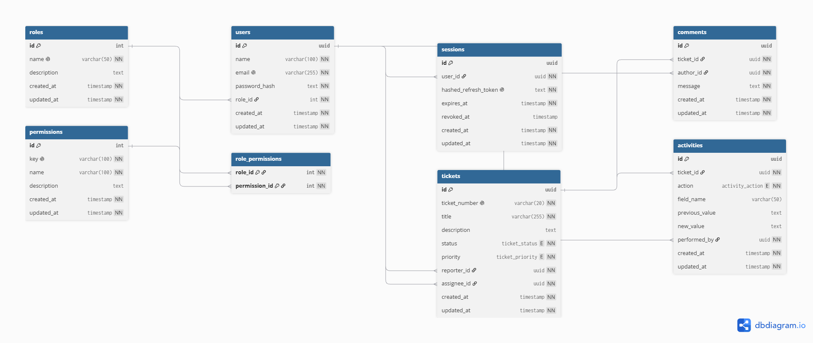

# Database Design

# Quest

> Modern Support Ticket Management Platform

**Version:** 1.0.0  
**Status:** Final  
**Last Updated:** July 2026

---

# 1. Purpose

This document describes the database architecture for Quest.

It explains the database design decisions, entity relationships, constraints, and conventions used throughout the application.

The detailed schema is maintained separately in `docs/assets/db/quest.dbml`, which serves as the canonical source of truth for the database structure.

---

# 2. Database Technology

Quest uses the following technologies for data persistence.

- PostgreSQL
- Prisma ORM

PostgreSQL provides a reliable relational database while Prisma offers type-safe database access, schema management, and migrations.

---

# 3. Design Principles

The database has been designed around the following principles.

- Keep the schema normalized.
- Preserve referential integrity.
- Use UUIDs for business entities.
- Use integer identifiers for lookup tables.
- Keep business logic outside the database.
- Store only data required by the current product.
- Design for future extensibility without unnecessary complexity.

---

# 4. Database Schema

The complete database schema is maintained in:

```text
docs/assets/db/quest.dbml
```

This DBML file should be considered the single source of truth for all database changes.

Any schema modifications should be made in the DBML file before being implemented through Prisma migrations.

---

# 5. Entity Relationship Diagram

The diagram below is generated directly from the DBML schema.



---

# 6. Core Entities

Quest currently consists of the following entities.

## User

Represents authenticated users of the application.

Users can:

- Authenticate
- Create tickets
- Be assigned tickets
- Write comments
- Perform ticket actions

---

## Role

Defines the role assigned to each user.

The initial release includes:

- Member
- Manager

The Role entity forms the foundation of the RBAC system.

---

## Permission

Represents an individual system capability.

Examples include:

- Create Ticket
- Update Ticket
- Delete Ticket
- Assign Ticket
- Add Comment

Permissions are assigned to roles through the RolePermission table.

---

## RolePermission

Implements the many-to-many relationship between Roles and Permissions.

This provides a flexible authorization model while allowing future expansion without changing the database structure.

---

## Session

Represents an authenticated login session.

Each session stores:

- Hashed Refresh Token
- Expiration
- Revocation status

This design supports:

- Multiple concurrent logins
- Refresh token rotation
- Single-device logout
- Logout from all devices

---

## Ticket

Represents a support request.

Each ticket contains:

- Human-readable Ticket Number
- Title
- Description
- Status
- Priority
- Reporter
- Assignee

Internally, tickets use UUIDs while users interact with ticket numbers such as:

```
QST-001
```

---

## Comment

Represents discussions attached to a ticket.

Comments belong to a single ticket and are authored by a user.

---

## Activity

Represents the audit history of a ticket.

Rather than storing complete messages, activities capture structured changes including:

- Action
- Field Name
- Previous Value
- New Value
- Performed By

The frontend is responsible for converting these records into human-readable activity logs.

---

# 7. Relationships

The database contains the following primary relationships.

| Relationship | Type |
|--------------|------|
| User → Role | Many-to-One |
| Role → Permission | Many-to-Many |
| User → Session | One-to-Many |
| User → Ticket (Reporter) | One-to-Many |
| User → Ticket (Assignee) | One-to-Many |
| Ticket → Comment | One-to-Many |
| Ticket → Activity | One-to-Many |

---

# 8. Enumerations

Quest currently defines the following enumerations.

## Ticket Status

- Open
- In Progress
- Resolved
- Closed
- Cancelled

---

## Ticket Priority

- Low
- Medium
- High
- Urgent

---

## Activity Action

- Created
- Updated
- Deleted
- Comment Added

---

# 9. Authentication Design

Quest uses a session-based authentication model with JWT access tokens and HttpOnly refresh token cookies.

Each successful login creates a new session associated with a hashed refresh token. The `sessions` table is the source of truth for active sessions.

Refresh tokens are hashed using `SHA-256(refreshToken + serverPepper)` before storage. Passwords are hashed using bcrypt.

This architecture enables:

- Secure refresh token storage
- Independent login sessions
- Refresh token rotation
- Immediate session revocation on logout
- Future session management

Access Tokens remain stateless and are not stored in the database. They are stored in frontend memory only and are never persisted in browser storage or cookies.

On every authenticated request, the backend validates the JWT, verifies the session is active, and loads the latest user role and permissions from the database.

---

# 10. Database Conventions

Quest follows several database conventions.

## Primary Keys

- UUID for business entities.
- Integer IDs for lookup tables.

---

## Timestamps

Every entity (except junction tables) includes:

- created_at
- updated_at

---

## Naming

- Snake_case column names
- Plural table names
- Singular entity names within documentation

---

## Foreign Keys

Foreign keys consistently use the `<entity>_id` naming convention.

Examples:

- role_id
- user_id
- ticket_id
- author_id

---

# 11. Indexing Strategy

Indexes are maintained on commonly queried fields.

Examples include:

- email
- ticket_number
- status
- priority
- reporter_id
- assignee_id

Additional indexes should only be introduced after identifying real performance bottlenecks.

---

# 12. Data Lifecycle

Quest currently uses hard deletion for tickets.

Deleted records are permanently removed from the database.

Future versions may adopt soft deletion if audit retention becomes a product requirement.

---

# 13. Future Considerations

The current schema provides a foundation for future enhancements without requiring structural redesign.

Potential future additions include:

- User Management
- Custom Role Management
- Permission Management
- Attachments
- Notifications
- Labels
- Kanban Boards
- Organizations
- Multiple Workspaces

These features are intentionally excluded from the current implementation.

---

# 14. Summary

The Quest database has been designed to balance simplicity with scalability.

The schema supports the current product requirements while providing a solid architectural foundation for future enhancements.

All schema modifications should begin with updates to `quest.dbml`, ensuring the ER diagram, documentation, and Prisma schema remain synchronized throughout the project.